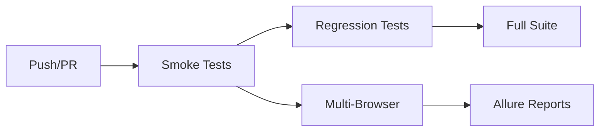

# 🤖 Robot Framework - Enhanced Test Automation Suite

**Projeto avançado de automação de testes** utilizando Robot Framework com SeleniumLibrary, implementando **Page Object Model (POM)**, **waits inteligentes**, **multi-browser support** e **CI/CD pipeline completo**.

## 🎯 Visão Geral

Suite de testes **enterprise-ready** para [the-internet.herokuapp.com](https://the-internet.herokuapp.com/) com **57+ cenários automatizados**, cobrindo funcionalidades web modernas e casos de uso complexos.

### ✨ Funcionalidades Principais

- 🔐 **Authentication**: Login/logout com data-driven testing
- 🎛️ **Dynamic Controls**: Controles que mudam de estado com waits inteligentes
- 🚨 **JavaScript Alerts**: Interação completa com diálogos nativos
- 📁 **File Operations**: Upload/download de arquivos
- 🧭 **Navigation**: Cobertura completa de 42+ páginas
- ➕ **Dynamic Elements**: Adição/remoção de elementos DOM
- ☑️ **Form Controls**: Checkboxes, dropdowns, inputs avançados
- 🖱️ **User Interactions**: Hover, drag-drop, key presses
- 📊 **Data Tables**: Manipulação de tabelas sortáveis
- 🎨 **UI Components**: Sliders, menus, modals, frames

## 🏗️ Arquitetura Enterprise

```
the_internet_robot/
├── 📄 requirements.txt                # Dependências com Allure, PyYAML
├── 📄 CHANGELOG.md                   # Histórico de versões
├── 📄 .env.example                   # Template de variáveis de ambiente
├── 🚀 run_tests_enhanced.bat         # Script multi-browser/ambiente
├── 📁 config/
│   ├── test_config.yaml             # ⭐ Configuração centralizada
│   └── locators.py                   # Localizadores (legacy)
├── 📁 libraries/
│   └── CustomKeywords.py             # ⭐ Waits inteligentes
├── 📁 data/
│   └── test_data.csv                 # ⭐ Data-driven testing
├── 📁 tests/
│   ├── ImprovedTests.robot           # ⭐ Suite principal melhorada
│   ├── AllTestsFixed.robot           # Suite completa (57 cenários)
│   └── [legacy suites...]            # Suites individuais
├── 📁 resources/
│   ├── common/
│   │   ├── common_setup.resource     # Setup global
│   │   └── headless_keywords.resource # ⭐ Multi-browser support
│   └── pages/                        # Page Objects (POM)
│       └── [11 page objects...]
├── 📁 results/
│   ├── execution_YYYY-MM-DD_HH-MM-SS/ # ⭐ Histórico timestampado
│   └── allure-results/               # ⭐ Relatórios Allure
└── 📁 .github/workflows/
    └── ci_pipeline.yml               # ⭐ Pipeline multi-stage
```

## 🚀 Configuração e Instalação

### Pré-requisitos

- **Python 3.8+**
- **Git**
- **Chrome/Firefox/Edge** (para execução local)

### Instalação Rápida

```bash
# 1. Clone o repositório
git clone <repository-url>
cd the_internet_robot

# 2. Crie ambiente virtual
python -m venv venv
venv\Scripts\activate  # Windows
source venv/bin/activate  # Linux/Mac

# 3. Instale dependências
pip install -r requirements.txt

# 4. Configure ambiente (opcional)
cp .env.example .env
# Edite .env com suas configurações
```

## 🎮 Execução dos Testes

### 🚀 Execução Melhorada (Recomendada)

```bash
# Execução padrão (Chrome, Prod, Headed)
run_tests_enhanced.bat

# Multi-browser testing
run_tests_enhanced.bat Chrome prod False
run_tests_enhanced.bat Firefox staging True
run_tests_enhanced.bat Edge dev False
```

### 🎯 Execução por Tags

```bash
# Testes críticos
robot --include Smoke --variable HEADLESS_MODE:False tests/ImprovedTests.robot

# Testes de regressão
robot --include Regression tests/ImprovedTests.robot

# Testes específicos
robot --include "JavaScript AND Enhanced" tests/ImprovedTests.robot
```

### ⚡ Execução Manual Avançada

```bash
# Com waits inteligentes
robot --outputdir results tests/ImprovedTests.robot

# Suite completa (57 cenários)
robot --outputdir results tests/AllTestsFixed.robot

# Com relatórios Allure
robot --listener allure_robotframework tests/ImprovedTests.robot
```

## 📊 Análise de Resultados

### 📈 Relatórios Disponíveis

```bash
results/execution_YYYY-MM-DD_HH-MM-SS/
├── 📄 report.html          # Resumo executivo
├── 📄 log.html             # Debug detalhado
├── 📄 output.xml           # Dados estruturados
├── 📁 allure-results/      # Dados Allure
└── 🖼️ selenium-screenshot-*.png # Screenshots automáticos
```

### 🎨 Relatórios Allure (Avançados)

```bash
# Gerar relatório Allure
allure serve results/allure-results

# Ou gerar estático
allure generate results/allure-results --output allure-report
```

### 📱 Visualização

- **report.html**: Abrir no navegador para resumo
- **log.html**: Debug passo a passo com screenshots
- **Allure**: Dashboard interativo com métricas

## 🔄 Pipeline CI/CD Multi-Stage

### 🎯 Estratégia de Execução



### 🚀 Stages do Pipeline

1. **Smoke Tests**: Testes críticos (Chrome apenas)
2. **Regression Tests**: Testes completos (Chrome + Firefox)
3. **Full Suite**: Todos os testes (Chrome + Firefox + Edge)
4. **Scheduled**: Execução diária automática

### 📊 Triggers Disponíveis

- **Push/PR**: Smoke + Regression
- **Schedule**: Daily full suite (2 AM)
- **Manual**: Escolha browser/ambiente
- **File Changes**: Apenas se arquivos de teste mudaram

### 🎨 Artefatos Gerados

- **Robot Reports**: HTML + XML + Screenshots
- **Allure Reports**: Dashboard interativo
- **Multi-Browser**: Resultados por navegador
- **Retention**: 7-30 dias conforme criticidade

## 🛠️ Manutenção do Page Object Model

### Estrutura de Responsabilidades

- **Locators** (`config/locators.py`): Centralizados em classes Python
- **Keywords** (`resources/pages/*.resource`): Interações com a UI
- **Tests** (`tests/*.robot`): Lógica de negócio e cenários

### Adicionando Novos Testes

1. **Adicione locators** em `config/locators.py`:
```python
class NovaPageLocators:
    ELEMENTO = "id:meu-elemento"
```

2. **Crie keywords** em `resources/pages/NovaPage.resource`:
```robot
*** Keywords ***
Interagir Com Elemento
    Click Element    ${NovaPageLocators.ELEMENTO}
```

3. **Escreva o teste** em `tests/NovoTeste.robot`:
```robot
*** Test Cases ***
Meu Novo Teste
    [Tags]    Smoke
    Interagir Com Elemento
```

## 🔧 Solução Técnica: Headed vs Headless

O projeto resolve a dualidade de execução através de:

- **Variável de controle**: `${HEADLESS_MODE}`
- **Keyword condicional**: `Setup Test Environment`
- **Injeção de opções**: Chrome options via Python/Selenium API

Esta abordagem elimina a necessidade de Docker, simplificando o pipeline.

## 🏷️ Sistema de Tags

### 🎯 Tags Principais

| Tag | Descrição | Uso |
|-----|-----------|-----|
| `Smoke` | Testes críticos | CI/CD rápido |
| `Regression` | Testes completos | Release validation |
| `Enhanced` | Testes melhorados | Waits inteligentes |
| `DataDriven` | Testes baseados em dados | Múltiplos cenários |

### 🔧 Tags Funcionais

| Categoria | Tags | Cenários |
|-----------|------|----------|
| **Auth** | `Login`, `Authentication` | 6+ |
| **Forms** | `Forms`, `Checkboxes`, `Dropdown` | 12+ |
| **Interaction** | `JavaScript`, `Hovers`, `KeyPresses` | 15+ |
| **Navigation** | `Navigation` | 42+ |
| **Dynamic** | `Dynamic`, `AddRemove` | 8+ |

### 🎮 Exemplos de Uso

```bash
# Combinação de tags
robot --include "Smoke AND Enhanced" tests/

# Exclusão de tags
robot --exclude "Slow OR Flaky" tests/

# Tags específicas
robot --include "JavaScript AND NOT Regression" tests/
```

## 🔧 Configuração Avançada

### ⚙️ Arquivo de Configuração (config/test_config.yaml)

```yaml
environments:
  dev: "https://dev.the-internet.herokuapp.com/"
  staging: "https://staging.the-internet.herokuapp.com/"
  prod: "https://the-internet.herokuapp.com/"

browsers:
  chrome: { name: "Chrome", headless_args: ["--headless", "--no-sandbox"] }
  firefox: { name: "Firefox", headless_args: ["--headless"] }
  edge: { name: "Edge", headless_args: ["--headless"] }

timeouts:
  default: 10
  slow_operations: 30
```

### 🔐 Variáveis de Ambiente (.env)

```bash
TEST_USERNAME=tomsmith
TEST_PASSWORD=SuperSecretPassword!
BROWSER=Chrome
HEADLESS_MODE=False
DEFAULT_TIMEOUT=10
```

### 📊 Data-Driven Testing

- **CSV Files**: `data/test_data.csv`
- **Templates**: Testes parametrizados
- **Dynamic Data**: Faker integration

## 🚀 Funcionalidades Avançadas

### ⚡ Waits Inteligentes

```robot
# Substituiu Sleep por waits baseados em condições
Smart Wait For Element Visible    css:.flash
Smart Click Element    id:login-button
Smart Input Text    id:username    ${username}
```

### 🌐 Multi-Browser Support

- **Chrome**: Padrão, mais rápido
- **Firefox**: Compatibilidade
- **Edge**: Ambiente corporativo

### 📈 Métricas e Monitoramento

- **Screenshots automáticos** em falhas
- **Relatórios Allure** com dashboards
- **Histórico timestampado** de execuções
- **Pipeline multi-stage** com retry

## 🤝 Contribuição

1. **Fork** do projeto
2. **Branch** para feature (`git checkout -b feature/nova-funcionalidade`)
3. **Commit** mudanças (`git commit -m 'Add: nova funcionalidade'`)
4. **Push** para branch (`git push origin feature/nova-funcionalidade`)
5. **Pull Request** com descrição detalhada

### 📋 Checklist de Contribuição

- [ ] Testes passando localmente
- [ ] Documentação atualizada
- [ ] Tags apropriadas nos testes
- [ ] Screenshots/evidências incluídas
- [ ] Pipeline CI/CD validado

## 📚 Recursos Adicionais

- **Robot Framework**: [Documentação Oficial](https://robotframework.org/)
- **SeleniumLibrary**: [Keywords Reference](https://robotframework.org/SeleniumLibrary/)
- **Allure Reports**: [Guia Completo](https://docs.qameta.io/allure/)
- **CHANGELOG.md**: Histórico detalhado de versões